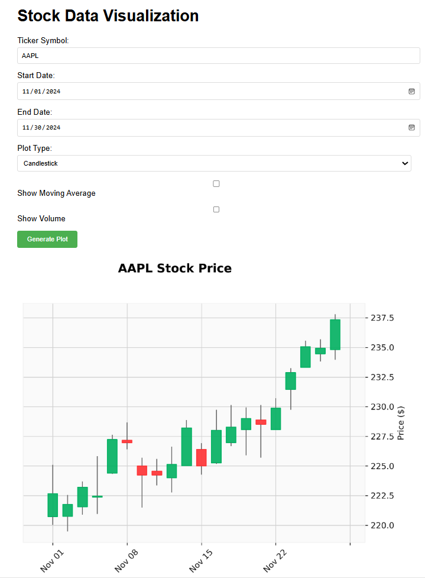

# D8TAVu Stock Data Visualization Web Application

A web application for visualizing stock market data using Flask, React, and yfinance.

## Interface Example

*Example of D8TAVu showing stock data visualization with interactive controls*

## Setup and Configuration Scripts

All setup and configuration scripts are located in the `scripts` directory:

### IIS Setup Scripts (Run as Administrator)
- `scripts/install_iis_components.bat`: Installs required IIS components and features
- `scripts/unlock_iis_sections.bat`: Unlocks necessary IIS configuration sections
- `scripts/enable_wfastcgi.bat`: Enables FastCGI support in IIS

### Environment Setup
- `scripts/create_web_env.ps1`: Creates and configures the Python virtual environment in IIS
- `scripts/fix_permissions.ps1`: Fixes common permission issues with the site packages
- `scripts/set_permissions.ps1`: Sets appropriate permissions for IIS and application directories
- `scripts/restart_iis.ps1`: Safely restarts IIS and the application pool

### Permission Management
- `scripts/set_permissions.bat`: Sets initial permissions for IIS and Python directories
  - Grants necessary permissions to IIS_IUSRS and AppPool
  - Sets up access rights for the web and Python environment
  - Run this after initial installation

- `scripts/fix_permissions.ps1`: Advanced permission fixes
  - Resolves complex permission issues
  - Handles nested directory permissions
  - Use when experiencing access denied errors

### IIS Management
- `scripts/restart_iis.ps1`: PowerShell script to restart IIS and application pool
  - Safely stops and starts services
  - Resets application pool
  - Use after configuration changes

## Common Tasks

### Initial Setup
1. Install IIS Components:
   ```batch
   .\scripts\install_iis_components.bat
   ```

2. Configure IIS:
   ```batch
   .\scripts\unlock_iis_sections.bat
   .\scripts\enable_wfastcgi.bat
   ```

3. Set Up Environment:
   ```powershell
   .\scripts\create_web_env.ps1
   ```

4. Set Permissions:
   ```batch
   .\scripts\set_permissions.bat
   ```

### Troubleshooting

1. Permission Issues:
   ```powershell
   .\scripts\fix_permissions.ps1
   ```

2. IIS Reset:
   ```powershell
   .\scripts\restart_iis.ps1
   ```

## Common Issues and Solutions

### Permission Issues
1. Environment Access:
   ```powershell
   # Run fix_permissions.ps1 with administrator privileges
   .\scripts\fix_permissions.ps1
   ```

2. Site-specific Permissions:
   ```powershell
   # Use set_permissions.ps1 for targeted fixes
   .\scripts\set_permissions.ps1 -path "path\to\directory" -user "IIS APPPOOL\D8TAVu"
   ```

### IIS Configuration
1. Application Pool Problems:
   ```powershell
   # Restart IIS and app pool
   .\scripts\restart_iis.ps1
   ```

2. Python Integration:
   - Verify web.config settings
   - Check FastCGI configuration
   - Ensure environment paths are correct

### Data Handling
- Date format: YYYY-MM-DD
- Moving averages: Integer periods only
- Volume display: Optional boolean parameter

## Recent Updates

### Plot Branch Merge
- Improved date handling in stock data response
- Enhanced error handling and logging
- Added comprehensive frontend validation
- Updated IIS configuration for better stability

## Configuration Files

### environment.yml
Contains all Python dependencies including:
- Flask
- yfinance
- pandas
- matplotlib
- mplfinance

### web.config
IIS configuration including:
- FastCGI settings
- Python handler mapping
- Environment variables

## Development Notes

### Virtual Environment
Located at: `C:\inetpub\wwwroot\D8TAVu\env`
Activate using:
```powershell
C:\inetpub\wwwroot\D8TAVu\env\Scripts\activate
```

### Debug Mode
Enable debug logging in app.py for troubleshooting:
```python
app.logger.setLevel(logging.DEBUG)
```

## Security Considerations
- All scripts should be run with appropriate privileges
- Regularly update Python packages
- Monitor IIS logs for errors
- Implement rate limiting for API calls
